Инструкция по установке и запуску языка Golang

Данная инструкция в основном написана для ОС Windows 7 и выше (x64), и для Visual Studio Code. Это не будет касаться сред разработки (IDE) от JetBrains (IJ и Goland).

Список необходимых программ:
*	Драйвер языка Golang
* *	Ссылки для скачивания: https://go.dev/dl/
* *	Для ОС Windows 7 и выше (x64): https://go.dev/dl/go1.18.windows-amd64.msi
*	Среда разработки Visual Studio Code
* *	Ссылки для скачивания: https://code.visualstudio.com/Download
* *	Для ОС Windows 7 и выше (x64): https://code.visualstudio.com/sha/download?build=stable&os=win32-x64-user
*	Драйвер Node.js
* *	Ссылки для скачивания: https://nodejs.org/en/download/
* *	Для ОС Windows 7 и выше (х64): https://nodejs.org/dist/v16.14.1/node-v16.14.1-x64.msi

Скачиваем и устанавливаем вышеперечисленные компоненты.

Запускаем VSCode

Создаем рабочий каталог (папку) либо открываем уже существующую:

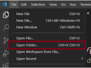

Наша рабочая среда будет выглядеть таким образом:

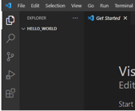

Создаем новый файл и называем “main.go”:

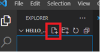

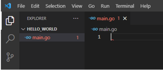

Можно также добавить уже существующий файл, открыв его (Open file)

После этого действия VSCode может предложить установку модулей в правом нижнем углу. Соглашаемся на все установки. Этим и является достоинство VSCode. Ждем когда установятся компоненты и переходим к следующему действию.

Открываем командную строку (cmd.exe), переходим к нашей рабочей папке при помощи команды cd в консоли. Пишем следующую команду: “go mod init main.go”. Это создаст файл “go.mod” нужный для запуска проекта на Golang.

Необязательный шаг. У вас может возникнуть ошибка “GOPATH is empty”. В этом случае указываем путь до установленных компонентов (по-умолчанию: C:\Program Files\Go)

Необязательный шаг. Также может возникнуть ошибка с версиями (особенно с версией go1.17). Переходим по пути “C:\Program Files\Go\src\runtime\internal\sys” и открываем файл “zversion.go” добавляем новую строку: “const theVersion = `go1.17`” (версию меняем на свою). Перезапускаем программу.

Начинаем редактировать файл main.go, добавляем строку “package main”:

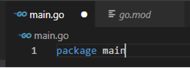
        
Это обязательно, файлы в Golang организованы в таких «пакетах» и большой проект будет выглядеть как «коллекция из пакетов».

Затем добавляем строку «import “fmt”» (fmt с кавычками):

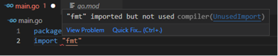

Однако тут возникает ошибка, которая видна на скриншоте. Это еще одна из особенностей языка Golang. Все импортированные компоненты, проинициализированные переменные должны быть использованы. Иначе будет возникать ошибка. А сам компонент “fmt” – самый основной.

Добавляем функцию “main” и пишем первую команду:

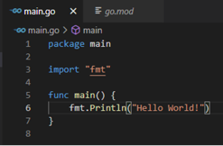

Как видим, ошибка исчезла и встроенные функции придется писать через точку от нужного компонента.

Попробуем запустить и убедится, что наш проект работает:

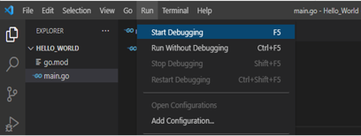

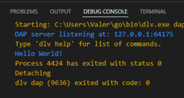

Внизу программы можно будет увидеть результат нашего кода. Однако этот метод вывода не совершенен, и забегая наперед ввод в программу осуществить таким образом не получится, так как еще не добавили встроенную поддержку для языка Golang (программа будет просто пропускать метод ввода). Поэтому сразу переходим к следующему шагу.

Слева появится надпись, нажимаем на нее (launch.json) либо создаем вручную файл внутри папки проекта как на 3 скриншоте и обновляем файловый эксплорер:

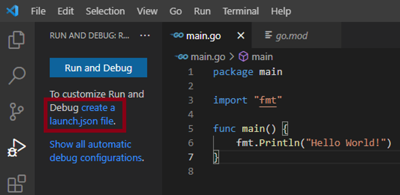

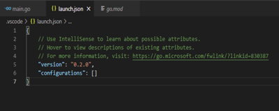

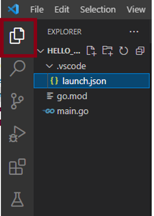

Данный файл нужен для запуска проекта с определенными конфигурациями, которые мы запишем вот так:

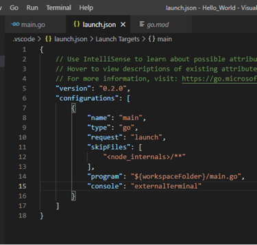

* “type”, “request”, “program” – пишем обязательно таким образом.
* “console” – рекомендую как написано в скриншоте (внешняя консоль – cmd, или иная другая если у вас установлена таковая).
* “type” – нужен для определения синтаксиса языка в Node.js
* “request” – для типа «запуска»
* “program” – путь к проекту (к главному файлу)

Теперь еще раз запускаем проект на кнопку F5 или через Run -> Start Debugging:

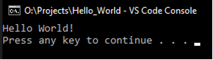

Среда разработки на Golang готова!

Полезные ссылки:
*	Полный базовый курс по Golang (на англ.): https://www.youtube.com/watch?v=yyUHQIec83I
*	Обучение по Go (на русском): https://metanit.com/go/
* *	Руководство по Go: https://metanit.com/go/tutorial/
* *	Веб-программирование по Go: https://metanit.com/go/web/
*	Подключение Go к MySQL: https://github.com/go-sql-driver/mysql
